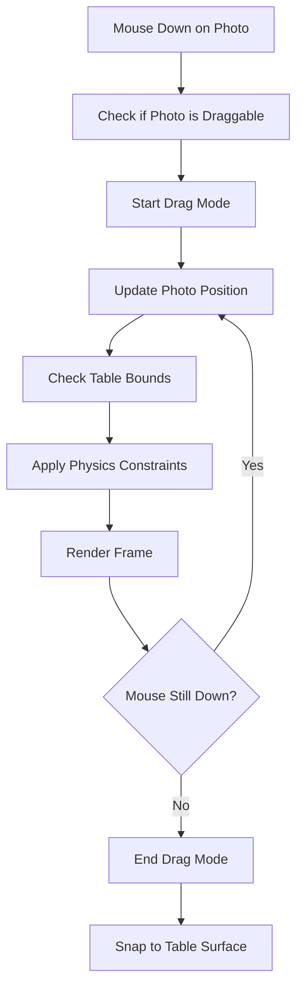
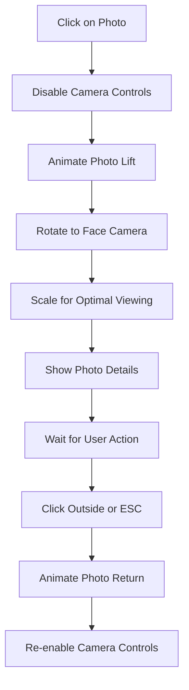

# 3D Photo Gallery Architecture

## Project Overview

A professional photography showcase featuring a 3D gallery space with interactive photo manipulation using Three.js.

## Technical Stack

- **Frontend Framework**: Vanilla JavaScript with Three.js
- **3D Graphics**: Three.js (latest version)
- **Build Tool**: Vite for development and bundling
- **Styling**: CSS3 with modern features
- **Photo Loading**: Dynamic import from assets folder

## System Architecture

### Core Components

#### 1. Scene Management (`src/scene/`)

- **SceneManager.js**: Main scene orchestrator
- **Camera.js**: Camera controls and positioning
- **Renderer.js**: WebGL renderer configuration
- **Lighting.js**: Museum-quality lighting setup

#### 2. Environment (`src/environment/`)

- **Room.js**: Gallery room geometry and materials
- **Table.js**: Marble table 3D model
- **Materials.js**: PBR materials for realistic rendering

#### 3. Photo System (`src/photos/`)

- **PhotoLoader.js**: Dynamic photo loading from assets
- **PhotoMesh.js**: Photo object creation and materials
- **PhotoScatterer.js**: Algorithm for natural photo placement
- **PhotoInteraction.js**: Drag, drop, and selection logic

#### 4. Interaction (`src/interaction/`)

- **DragController.js**: Photo dragging mechanics
- **SelectionController.js**: Photo selection and lift animation
- **CameraController.js**: Orbital camera controls

#### 5. UI/UX (`src/ui/`)

- **LoadingScreen.js**: Initial loading experience
- **ErrorHandler.js**: Graceful error handling
- **ResponsiveManager.js**: Mobile and tablet adaptations

## 3D Scene Design

### Gallery Room Specifications

```
Dimensions: 12m × 8m × 4m (W × D × H)
Walls: Clean white with subtle texture
Floor: Polished concrete with reflections
Ceiling: Hidden with soft ambient lighting
```

### Marble Table Design

```
Dimensions: 3m × 2m × 0.8m (W × D × H)
Material: Carrara marble with realistic veining
Position: Center of room, slightly angled
Surface: Slightly reflective with micro-roughness
```

### Lighting System

```
Primary: Soft box lighting from ceiling (3000K)
Secondary: Rim lighting for photo edges (4000K)
Ambient: Low-intensity environment lighting (2700K)
Shadows: Soft contact shadows for realism
```

## Photo Management

### Loading Strategy

```javascript
// Dynamic photo discovery
const photoManifest = await generatePhotoManifest('./assets/photos/');
const photos = await loadPhotosInBatches(photoManifest, batchSize: 5);
```

### Photo Object Structure

```javascript
class PhotoMesh {
  geometry: PlaneGeometry(aspectRatio)
  material: MeshPhysicalMaterial({
    map: photoTexture,
    roughness: 0.1,
    metalness: 0.0,
    clearcoat: 0.8
  })
  physics: { draggable: true, bounds: tableSurface }
  animation: { liftHeight: 0.5, rotationSpeed: 0.02 }
}
```

### Scattering Algorithm

```
1. Divide table surface into grid cells
2. Apply Poisson disk sampling for natural spacing
3. Add slight rotation variance (-15° to +15°)
4. Ensure no overlapping with collision detection
5. Apply subtle height variation for realism
```

## Interaction Design

### Drag and Drop Flow



### Photo Selection Flow



## Performance Optimization

### Rendering Optimizations

- **Level of Detail (LOD)**: Reduce photo resolution based on distance
- **Frustum Culling**: Only render visible photos
- **Instanced Rendering**: Efficient photo frame rendering
- **Texture Compression**: WebP format with fallbacks

### Memory Management

- **Lazy Loading**: Load photos as they come into view
- **Texture Pooling**: Reuse texture memory
- **Garbage Collection**: Proper cleanup of unused resources

### Frame Rate Targets

- **Desktop**: 60 FPS at 1920×1080
- **Mobile**: 30 FPS at device resolution
- **Adaptive Quality**: Dynamic quality adjustment

## File Structure

```
gallery2/
├── index.html
├── package.json
├── vite.config.js
├── src/
│   ├── main.js
│   ├── scene/
│   │   ├── SceneManager.js
│   │   ├── Camera.js
│   │   ├── Renderer.js
│   │   └── Lighting.js
│   ├── environment/
│   │   ├── Room.js
│   │   ├── Table.js
│   │   └── Materials.js
│   ├── photos/
│   │   ├── PhotoLoader.js
│   │   ├── PhotoMesh.js
│   │   ├── PhotoScatterer.js
│   │   └── PhotoInteraction.js
│   ├── interaction/
│   │   ├── DragController.js
│   │   ├── SelectionController.js
│   │   └── CameraController.js
│   ├── ui/
│   │   ├── LoadingScreen.js
│   │   ├── ErrorHandler.js
│   │   └── ResponsiveManager.js
│   └── utils/
│       ├── MathUtils.js
│       └── AssetLoader.js
├── assets/
│   ├── photos/
│   │   └── [your photo files]
│   ├── textures/
│   │   ├── marble/
│   │   └── environment/
│   └── models/
└── styles/
    ├── main.css
    └── loading.css
```

## Development Phases

### Phase 1: Foundation (Days 1-2)

- Project setup with Vite
- Basic Three.js scene
- Camera and renderer configuration

### Phase 2: Environment (Days 3-4)

- Gallery room creation
- Marble table modeling
- Lighting system implementation

### Phase 3: Photo System (Days 5-6)

- Photo loading mechanism
- Photo mesh creation
- Scattering algorithm

### Phase 4: Interactions (Days 7-8)

- Drag and drop functionality
- Photo selection and animation
- Camera controls

### Phase 5: Polish (Days 9-10)

- Performance optimization
- Responsive design
- Error handling and loading states

## Browser Compatibility

- **Modern Browsers**: Chrome 90+, Firefox 88+, Safari 14+, Edge 90+
- **WebGL Support**: WebGL 2.0 required
- **Mobile**: iOS Safari 14+, Chrome Mobile 90+

## Accessibility Considerations

- Keyboard navigation support
- Screen reader compatibility for photo metadata
- Reduced motion preferences
- High contrast mode support
